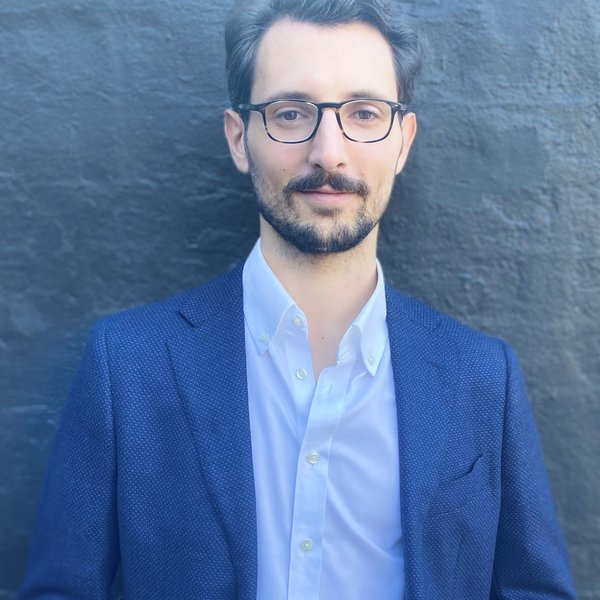

::: {.subtitle}
Research Fellow, University of Newcastle
:::

::: {.affiliations}
Tax and Transfer Policy Institute (ANU) · ARC Centre of Excellence for Children and Families over the Life Course
:::

::: {.grid}

::: {.g-col-12 .g-col-md-4}
<!-- TODO: drop a square headshot at assets/headshot.jpg, then this image will appear -->
{.headshot fig-alt="Photo of Fabio I. Martinenghi"}
:::

::: {.g-col-12 .g-col-md-8}

I am a Research Fellow at the University of Newcastle, within the **MandEval** project — a multi-university research project studying the impact of vaccine mandates on vaccine uptake.

My research focuses on **Health, Education, and Law & Economics**, where I apply modern econometric tools to large administrative datasets to answer policy-relevant questions.

::: {.contact-row}
<a href="mailto:fabio.martinenghi@newcastle.edu.au" aria-label="Email"><i class="bi bi-envelope"></i></a>

:::

:::

:::

## News

::: {.news-list}

[2026]{.news-date} — **Best Paper Award**, 15th Australasian Workshop on Econometrics and Health Economics (for *Career, Family, and IVF*, with Maryam Naghsh Nejad).

[2026]{.news-date} — *[An open repository of COVID-19 vaccine mandate studies](https://www.nature.com/articles/s41541-026-01454-4)* **published** in *npj Vaccines*.

[2026]{.news-date} — *Does refusing legal aid cause harm?* **accepted** at the *Journal of Law & Economics*.

[2025]{.news-date} — *Career, Family, and IVF*&nbsp; featured on the Grattan Institute's [Wonk List](https://grattan.edu.au/news/announcing-grattan-institutes-2025-wonks-list/).

[2025]{.news-date} — Presented *Career, Family, and IVF* at the American–European Health Economics Study Group.

:::
